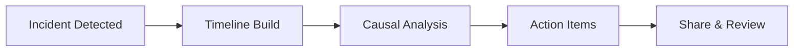

# Postmortem facilitation

> **Learning Path:** Technical Leadership & Delivery
> **Section:** 8.2.2 — Incident & operational leadership

## 1. Problem

Production-ல ஒரு major outage வந்தது. API latency spike ஆகி 15 நிமிடம் 500 errors கொடுத்தது. Customer impact இருந்தது, revenue loss நடந்தது.

Incident முடிந்ததும் team meeting-ல என்ன நடக்கும்?

> "அந்த deploy-ஐ நீதான் பண்ணினே"
> "நீ monitoring alert-ஐ miss பண்ணிட்ட"
> "ஏன் rollback பண்ணல?"

இதுவே மீண்டும் மீண்டும் நடக்கும். யாரும் உண்மையான systemic issue-ஐ பேச மாட்டார்கள். Same failure மறுபடியும் வரும்.

Postmortem facilitation-ன் problem இதுதான்: **incident-ஐ close பண்ணி blame பகிராமல், system-ஐ improve பண்ணும் learning-ஐ extract செய்வது**.

ஒரு incident-க்கு பிறகு "என்ன நடந்தது?" என்பதை விட முக்கியமானது "ஏன் நம்ம system அதை catch பண்ணல?" என்பதுதான்.

## 2. Mental Model

Postmortem = blame-free learning document.

இது court case அல்ல. இது system autopsy.

Core idea: **People are not bad, system made it easy to fail**.

ஒரு engineer தவறு செய்திருந்தால், அந்த தவறு ஏன் பாதுகாப்பாக நடக்க முடிந்தது? அதை தடுக்க system-ல என்ன missing? அதுதான் root cause-க்கு போகும் path.

Facilitator-ன் வேலை: conversation-ஐ facts-ல வைத்திருப்பது, emotions-ஐ குறைப்பது, action items-ஐ concrete ஆக்குவது.

## 3. How It Works

ஒரு நல்ல postmortem flow இப்படி இருக்கும்:

**Trigger:** Severity 1/2 incident close ஆனதும் 24-48 மணி நேரத்தில் schedule பண்ணு. Memory fresh-ஆ இருக்கும்.

**Participants:** Incident commander, on-call engineer, relevant service owners, one facilitator who didn't cause incident. Blamers இல்லாமல்.

**Timeline build:** UTC time-ல minute-by-minute timeline. "14:03 alert fired", "14:07 engineer paged", "14:12 rollback started". Facts மட்டும்.

**Five Whys / Causal chain:** ஏன் alert late? Because threshold too high. ஏன் threshold high? Because noise. ஏன் noise? Because metric not filtered.

**Action items:** Each item = Owner + Due date + Success criteria. "Improve alert" என்பது அல்ல. "Add SLO-based alert for p95 latency > 500ms for 5 min, owner: SRE team, due: 2 weeks".

**Share:** Internal wiki-ல publish. Broad learning.

Mermaid-ல சுருக்கமாக:

## 4. Architectural Reasoning

Postmortem எப்போது useful?

* Repeat incidents நடக்கும்போது
* New system launch-க்கு பிறகு
* Customer-facing outage / data loss / financial impact இருந்தால்

எப்போது skip பண்ணலாம்? Minor, one-off fluke, clear human error with immediate fix. அதற்கு mini retro போதும்.

Architect ஆக நீங்கள் decide பண்ண வேண்டியது:
* Process-ல gap உள்ளதா? அல்லது system design-ல gap உள்ளதா?
* நமக்கு observability போதுமா? Logging, metrics, tracing இல்லாததுதான் பிரச்சனையா?
* Change management weak ஆ? Rollback mechanism reliable இல்லையா?

Postmortem என்பது technical problem மட்டும் அல்ல. Org process, tooling, communication, on-call load எல்லாவற்றையும் expose பண்ணும்.

Alternatives: Blameless vs Blameful review. Blameful quick satisfaction தரும் ஆனால் learning hide ஆகும். Postmortem culture-ஐ நீங்கள் choose பண்ணினால் trust உருவாகும், engineers openly discuss mistakes.

## 5. Trade-offs

**Speed vs Depth:** Incident-க்கு பிறகு team exhausted. Deep dive உடனே நடத்தினால் quality குறையும். Delay பண்ணினால் memory fade ஆகும். 24-48 hrs sweet spot.

**Blameless vs Accountability:** Blameless என்பது no punishment அல்ல. System improve பண்ணாமல் repeat பண்ணினால் accountability இருக்க வேண்டும். Facilitator இதை balance பண்ண வேண்டும்.

**Openness vs Sensitivity:** Full transparency நல்லது ஆனால் sensitive details like customer PII or internal politics expose ஆகக்கூடாது. Document-ல அளவு முக்கியம்.

**Action items overload:** 20 items create பண்ணினால் எதுவும் close ஆகாது. 3-5 high leverage items மட்டும் focus பண்ணு.

Failure mode: Postmortem ஆகி document மட்டும் எழுதி close. No follow up. அப்போ இது theater.

## 6. Practical Example

Payment service-ல duplicate charge issue.

Timeline: 
13:00 deploy new payment service v2.1
13:15 latency increase
13:22 timeout errors start
13:30 client retry logic kicks in, duplicate requests
13:45 on-call notices, rollback starts
13:55 rollback complete

Root cause chain:
Timeout ஆனது ஏன்? Downstream bank API slow.
Downstream slow ஏன்? New version-ல retry logic இல்லாமல் timeout குறைத்து விட்டோம்.
Retry இல்லாதது ஏன்? Assumption: idempotency இருக்கும்.
Idempotency இல்லாதது ஏன்? Payment API design-ல idempotency key enforce பண்ணல.

Action items:
1. Payment API-ல idempotency key mandatory ஆக்கு
2. Client retry with exponential backoff + jitter
3. Bank API latency alert threshold reduce பண்ணு
4. Deploy with canary + automated rollback on error rate

இது தனிப்பட்ட engineer தவறு அல்ல. System design gap + observability gap.

## 7.
