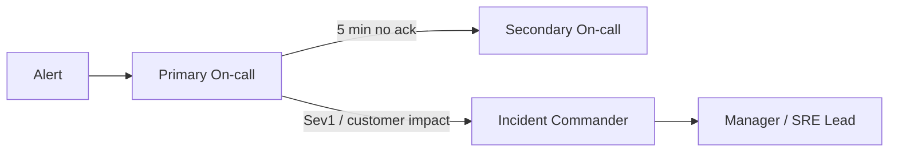

# On-call ownership

> **Learning Path:** Technical Leadership & Delivery
> **Section:** 8.2.3 — Incident & operational leadership

## 1. Problem

உங்கள் service-ல 2 AM-ல latency spike ஆகுது. Pager alert வருது. யார் பார்க்கணும்?

Dev team சொல்றாங்க: "இது deployment வந்ததுக்கு அப்புறம் தான் ஆரம்பிச்சுது, platform team பாருங்க."
Platform team சொல்றாங்க: "Infrastructure ஓகே, app logic பிரச்சனை, dev team தான்."
Product manager கேட்கறாங்க: "Customer impact எவ்ளோ? ETA என்ன?"

இந்த குழப்பம் தான் பிரச்சனை. On-call ownership இல்லாம, incident-க்கு யாருக்கும் clear responsibility இல்லை. MTTR ஏறுது, blame பரவுது, engineers burnout ஆகிறாங்க.

**"What goes wrong if we don't have this?"**  
எவரும் respond பண்ண மாட்டாங்க, எல்லாரும் respond பண்ணுவாங்க, decision stall ஆகும்.

## 2. Mental Model

On-call ownership = **Clear responsibility + Authority to act + Enough context to act fast.**

Ownership என்பது code எழுதினவர் மட்டும் இல்லை. Service-ன் health, reliability, customer impact-க்கு யார் finally answer பண்ணுவாங்கன்னு define பண்ணுவது.

ஒரு house-க்கு caretaker இருக்கார். Lock போடுவது, water leak பார்ப்பது, vendor-க்கு call பண்ணுவது எல்லாம் அவருக்கு தெரியும். நீங்கள் owner இல்லாமல் house விட்டா, பிரச்சனை வந்தப்போ யார் ஓடுவாங்கன்னு தெரியாது.

## 3. How It Works

ஒரு service-க்கு ஒரு owner team. அந்த team-ல on-call rotation.

Primary on-call: page வந்த உடனே investigate பண்ணி stabilize பண்ணுபவர்.
Secondary on-call: primary stuck ஆனால் escalation.
Incident Commander: incident-ன் coordination பார்ப்பவர், technical fix இல்லை, communication, timeline.

Escalation policy simple ஆக இருக்கணும்:

Runbook இருக்கணும், but ownership means runbook இல்லாமலும் decision எடுக்க தெரியும்.

## 4. Architectural Reasoning

On-call ownership என்பது org design choice.

**When useful?** Service boundaries clear ஆக இருக்கும்போது, multiple teams depend on each other. Monolith-ல ஒரே team இருந்தால் ownership implicit. Microservices-ல 10 teams இருந்தால் ownership explicit ஆக வேண்டும்.

**Constraint it addresses:** Latency to response, ambiguity in decision making, operational toil distribution.

Alternatives:
* No ownership: whoever is free picks up. → Chaos.
* Everyone owns everything: shared responsibility = no responsibility.
* Dedicated SRE only: dev team learns nothing, throw-over-the-wall.

Architect choose செய்யும் போது கேட்க வேண்டியது:
* Service-ன் blast radius என்ன?
* Team-க்கு production context இருக்கா?
* On-call load sustainable ஆ?

## 5. Trade-offs

**Responsiveness vs Burnout.** Tight rotation with small team = faster response but fatigue. Large rotation = less fatigue but slower context.

**Broad ownership vs Deep ownership.** One team owns full stack = fast decisions, but knowledge silo. Shared ownership across teams = better learning, but coordination overhead.

**Automation vs Human judgment.** Too much automation = alert fatigue reduced, but false negative risk. Too little = engineers tired.

Important failure mode: **Hero culture.** One senior engineer always solves. System learns nothing, bus factor high.

**Blameless vs Accountable.** Ownership இல்லைன்னா blame culture வரும். Ownership clear ஆனால் blameless postmortem வேண்டும், இல்லைன்னா people hide mistakes.

## 6. Practical Example

Enterprise payment service. Checkout service, fraud service, payment gateway adapter 3 teams.

ஒரு நாள் payment success rate drop ஆகுது. Alert வந்தது.

On-call ownership இருந்தா: Checkout team primary on-call. அவங்க dashboard பார்த்து error rate payment gateway adapter-ல இருந்து வருது என்று கண்டுபிடிக்கிறாங்க. அவங்க adapter team-ன் on-call-க்கு bridge channel-ல page பண்ணுவாங்க. Incident commander status update customer support-க்கு தருவாங்க.

On-call ownership இல்லாமல்: 3 teams Slack-ல "எங்க service ok" என்று சொல்லிக்கொண்டே இருக்கும். 45 min waste.

இங்கே ownership boundary தெளிவாக இருக்கிறது: Checkout owns customer-facing SLO, adapter owns integration SLO.

## 7. Reasoning Challenge

உங்களிடம் 20 microservices இருக்கு. 5 engineers மட்டும் team-ல. Full stack ownership வேண்டும். ஆனால் 2 AM page வரும்போது யாரும் தூங்க முடியாது.

இந்த constraint-ல நீங்கள் என்ன on-call model தேர்வு செய்வீர்கள்? Service grouping பண்ணுவீர்களா? Follow-the-sun rotation பண்ணுவீர்களா? Automation invest பண்ணுவீர்களா? ஏன்?

## 8. Key Takeaways

* Ownership = service-க்கு ஒரு team, team-க்கு ஒரு primary on-call, clear escalation.
* Fast response வேண்டுமானால் context வேண்டும். Context வேண்டுமானால் அந்த service-ஐ build பண்ணியவர்கள் தான் own பண்ண வேண்டும்.
* Every architectural solution creates trade-off. Ownership solves ambiguity, creates on-call load. Balance with rotation size, automation, and blameless learning.
* Incident command is coordination, not coding. Separate technical fix from communication.
