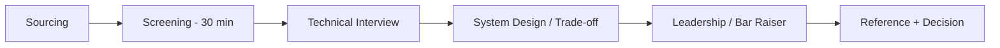

# Technical hiring & interviewing

> **Learning Path:** Technical Leadership & Delivery
> **Section:** 8.3.3 — People & process

## 1. Problem

உங்க team-ல ஒரு critical backend role 4 மாசமா open இருக்கு. Product roadmap block ஆகுது. Hiring manager interview கொடுக்க சொல்லி senior engineers-ஐ பிடுங்கிக்கிட்டே இருக்கீங்க. 

இன்னொரு பக்கம், 3 மாசத்துக்கு முன்னாடி hire பண்ண senior engineer, code quality ஓகே, ஆனா system trade-off பேச முடியல, team-ஐ lead பண்ண முடியல. அவரை onboard பண்ண நேரம், mentorship cost எல்லாம் waste.

இது என்ன problem? Hiring ஒரு system. Input candidates, process interviews, output hires. அந்த system-ல signal குறைவு, noise அதிகம். Bad hire-ன் cost ஒரு engineer-ஐ hire பண்ண cost-ஐ விட 3-5x. Slow hire-ன் cost delivery delay.

## 2. Mental Model

Hiring = Filtering with limited throughput.

உங்களுக்கு முக்கியம் 2 விஷயம்:
- **Predictive signal**: இந்த candidate production-ல perform பண்ணுவாரா?
- **Calibration**: இரண்டு interviewer-க்கும் same candidate-க்கு same decision வருமா?

ஒரு good interview process என்பது trivia test அல்ல. Role-ன் real constraints-ஐ replicate பண்ணி, candidate எப்படி reason பண்றான்னு பார்க்கிற system.

## 3. How It Works

A decent technical hiring pipeline architecturally இப்படி இருக்கும்:

Key components:
- **Bar definition**: Role-க்கு தேவையான concrete skills. Senior engineer ≠ coding speed.
- **Rubric**: 1-5 scale, what good looks like. Bias-ஐ குறைக்க.
- **Interview loop**: 3-4 interviews, each different signal. Coding, system design, architectural reasoning, collaboration.
- **Calibration**: Interviewers debrief together, decision not by individual gut feel.

## 4. Architectural Reasoning

ஒரு Solution Architect / Staff Engineer role-க்கு நீங்கள் test பண்ண வேண்டியது:
- Problem → Constraints → Options → Trade-off என்ற reasoning chain
- Distributed system failures, latency/throughput/cost trade-offs
- Communication and technical leadership

அதனால் live coding இல்லாமல், real scenario-based discussion வேலை செய்யும்.

When to use what:
- **Take-home**: Deep signal, ஆனால் candidate experience கெட்டு dropout அதிகம். Senior roles-ல மட்டும், clear time-box.
- **Live coding**: Junior/mid roles-க்கு fundamentals check. Senior-க்கு over-index பண்ணாதீங்க.
- **System design**: Architect roles-க்கு core signal. Candidate-க்கு ambiguous problem கொடுத்து, clarifying questions எப்படி கேட்கிறார், constraints எப்படி identify பண்றார் என்பதை பார்க்க.

Alternatives: unstructured chat vs structured rubric. Structured slow ஆனால் fair.

## 5. Trade-offs

**Speed vs Quality**: Fast hiring = more false positives. Slow hiring = good candidates accept வேறு place. Trade-off-ஐ control பண்ண process parallelism வேண்டும்.

**Signal vs Candidate Experience**: Deep take-home gives good signal, ஆனால் top candidates-க்கு painful. ஒரு reasonable signal குறைவாக இருந்தாலும் candidate experience சிறந்த process-ஐ தேர்வு செய்யுங்கள்.

**Standardization vs Flexibility**: Same rubric for all gives consistency. ஆனால் role-specific nuance miss ஆகும். Solution: core rubric common, role-specific add-ons.

**Interviewer cost**: Senior engineers interview பண்ணினால் delivery impact உண்டு. அதனால் interviewer pool-ஐ grow பண்ணி, rotation பண்ணி cost spread பண்ணுங்கள்.

Failure mode: Interviewer bias towards "culture fit" = comfort. அது diversity-ஐ kill பண்ணும். Rubric-ல behaviorally anchored questions வைக்கவும்.

## 6. Practical Example

Enterprise fintech company-ல Staff Engineer hire பண்ணணும். System: payment processing with high availability requirement.

Interview loop design:
1. Screening: past experience with distributed systems, failure handling
2. Technical: Idempotency, retry, timeout scenario பார்க்க
3. System design: Design a payment reconciliation service. Constraints: 10k TPS, 99.99% availability, data consistency
