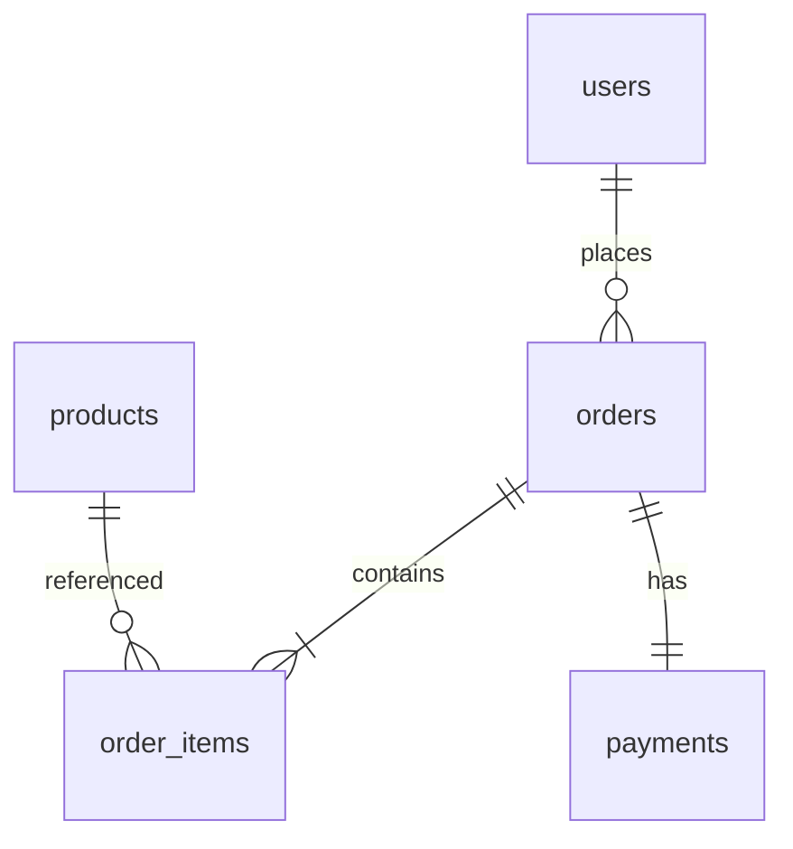

# Database schema design

> **Learning Path:** Non-AI System Design Practice
> **Section:** 9.1.5 — System design practice

## Problem

உங்க team ஒரு e-commerce platform build பண்ணுது. ஆரம்பத்தில் எல்லாம் simple.

`users`, `orders`, `order_items` மூணு tables போதும். MVP launch ஆகுது.

6 மாசம் கழித்து:

* Orders 10M+ ஆகிடுச்சு, monthly report query 30 seconds ஆகுது
* Product price மாறும், historical order-ல price மாறக்கூடாது
* Returns, coupons, multi-currency, gift wrapping வந்துருச்சு
* Mobile app-க்கு order summary தேவை, அதுக்கு 5 joins வேணும்

இப்போ schema-வை மாற்ற முயற்சிக்கும்போது migration 4 மணி நேரம் ஆகுது, app downtime வேணும், data inconsistency வருது.

**இங்கே பிரச்சனை என்ன?** Schema design என்பது table எப்படி இருக்கணும் என்பது மட்டும் இல்லை. Future access patterns, growth, team velocity எல்லாத்தையும் கணக்கில் வைத்து data-வை organize பண்ணுவது.

## Mental Model

Schema என்பது domain model-ன் perfect representation இல்லை. Schema என்பது **query patterns-க்கான contract**.

ஒரு mental model:

* Write path-க்கு: data integrity, consistency, minimal duplication வேணும்
* Read path-க்கு: fast access, fewer joins, predictable latency வேணும்

இந்த இரண்டும் எப்போதும் clash ஆகும். Schema design என்பது அந்த clash-ஐ conscious-ஆ manage பண்ணுவது.

## How It Works

அடிப்படையில் மூன்று decisions இருக்கு:

**1. Key design**
Primary key stable-ஆ இருக்கணும். Auto-increment `id` simple ஆனால் sharding-க்கு கஷ்டம். UUID globally unique ஆனால் index fragmentation கொடுக்கும். Business key ஆக order_number use பண்ணலாம், ஆனால் மாறாது என்பதை உறுதி செய்யணும்.

**2. Normalization vs Denormalization**
Normalization = 3NF, duplication குறைக்கும், write consistency easy.
Denormalization = read-க்கு pre-join பண்ணி ஒரே table-ல வைக்கும்.

உதாரணம்:
`orders` table-ல user_name-ஐ store பண்ணலாமா? User name மாறினால் history மாறும். அதனால் `users` table-ல வைத்து join செய்வது சரி. ஆனால் order summary list view-க்கு ஒவ்வொரு முறையும் join வேண்டாம் என்றால் denormalized copy வைக்கலாம்.

**3. Access pattern driven indexing & partitioning**
எந்த column-ல filter பண்ணுவீங்க? `orders(created_at, user_id)` என்றால் composite index order முக்கியம். Partition key-ஆக `created_at` monthly partition பண்ணினால் old data archive easy.

இது clean ஆனால் dashboard query-க்கு heavy.

## Architectural Reasoning

Schema தேர்வு use case-ஐ பார்த்து வரும்.

* **Transactional system, complex writes**: banking, inventory. Normalization தே
