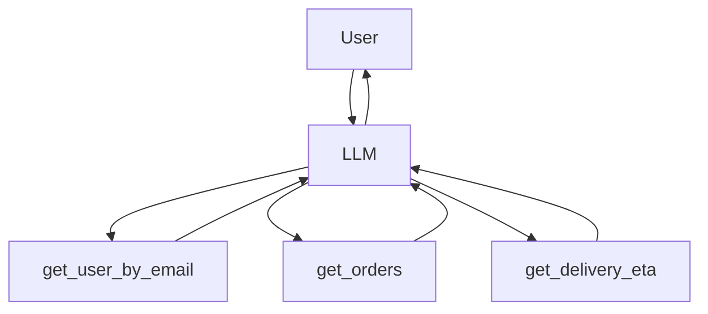

# Tool execution

> **Learning Path:** Tool Calling & AI Interfaces
> **Section:** 14.1.7 — Learn

## 1. Problem

LLM-க்கு knowledge cutoff இருக்கு, real-time data தேவைப்படுது. ஒரு user கேட்கிறார்: "என் portfolio-ல இன்றைய P/E ratio என்ன?"

Model தனியாக answer பண்ண முடியாது. அது ஒரு external system-ஐ call பண்ணணும்: database, API, calculator, search.

இங்கே பிரச்சனை என்ன? Model-ன் response quality, actionability அதன் ability to use tools-ல முடிஞ்சிருக்கு. Tools இல்லாம LLM ஒரு smart text generator மட்டும்தான்.

What goes wrong if we don't have tool execution? Hallucination, stale data, no side effects. User கேட்டதை செய்ய முடியாமல் போகும்.

## 2. Mental Model

Tool execution = LLM ஒரு decision maker, tools ஆனது actuators.

LLM thinks, then decides "இந்த step-க்கு எனக்கு tool தேவை". அது function call பண்ணும், parameters fill பண்ணும். Tool result திரும்ப வரும். அதை பார்த்து LLM மீண்டும் reason பண்ணி final answer build பண்ணும்.

இது ஒரு loop: **Reason → Call → Observe → Reason**.

Agent system-ல இது முக்கியம். RAG-ல vector search ஒரு tool. Calculator ஒரு tool. Web search ஒரு tool. Database query ஒரு tool.

## 3. How It Works

Practical flow:

1. User prompt வரும்.
2. LLM தனக்கு tool definition தெரியும். ஒவ்வொரு tool-க்கும் name, description, parameters schema இருக்கும்.
3. LLM decides tool call needed. JSON / structured output generate பண்ணும்.
4. Orchestrator அந்த call-ஐ validate பண்ணி actual service-க்கு forward பண்ணும்.
5. Tool result திரும்ப வரும். LLM-க்கு context-ல append ஆகும்.
6. LLM result-ஐ use பண்ணி user-க்கு natural answer கொடுக்கும்.

Key point: LLM tool-ஐ directly execute பண்ணாது. It only generates call intent. Execution happens outside model, in your application layer.

Idempotency, retries, timeouts, error handling எல்லாம் இந்த layer-ல manage ஆகணும்.

## 4. Architectural Reasoning

Tool execution useful ஆகும் போது:

* Real-time data தேவைப்படும் போது: stock price, weather, user profile
* Deterministic computation தேவைப்படும் போது: calculator, code execution
* Side effects தேவைப்படும் போது: send email, create JIRA ticket, book order
* Large / private knowledge base access: internal database, vector store

Alternatives:

* RAG only with static embeddings: offline data மட்டும்
* Fine-tuning model with data: costly, stale
* Prompt engineering with pre-fetched data: brittle, context window limit

Tool calling தேர்வு செய்யும் போது நீங்கள் gain பண்ணுவது flexibility மற்றும் freshness. Cost: latency, complexity, failure modes.

## 5. Trade-offs

**Latency vs Accuracy**: ஒவ்வொரு tool call-ம் network round trip. 3 tool calls = 3x latency. User experience degrade ஆகும். Parallel calls பண்ணலாம், ஆனால் dependency இருந்தால் sequential தான்.

**Correct tool selection**: Model wrong tool pick பண்ணலாம், wrong parameters generate பண்ணலாம். Schema validation மற்றும் guardrails தேவை.

**Error handling**: Tool timeout ஆகலாம், API rate limit ஆகலாம், tool return error. LLM-க்கு error message feed பண்ணி graceful recovery செய்ய வேண்டும். இல்லை என்றால் agent stuck ஆகும்.

**Security & Permissions**: Model எந்த tool-ஐயும் call பண்ண முடியும். Unauthorized tool call risk. Tool allowlist, parameter sanitization, user auth context pass செய்ய வேண்டும்.

**Observability**: Tool call history, input/output logging, cost tracking தேவை. Debugging கடினம்.

## 6. Practical Example

Enterprise support agent:

User: "என் last order எப்போது deliver ஆகும்?"

Reasoning:
1. User identity தேவை → call `get_user_by_email` tool
2. User ID கிடைத்தால் orders fetch → call `get_orders(user_id)`
3. Latest order status check → call `get_delivery_eta(order_id)`

Orchestrator:

இங்கே LLM data fetch பண்ணாது, decision மட்டும் பண்ணும். Tools deterministic results கொடுக்கும். Final answer context aware ஆக இருக்கும்.

## 7. Reasoning Challenge

உங்கள் agent-க்கு `web_search`, `calculator`, `database_query` மூன்று tools இருக்கு. User கேட்கிறார்: "நமது top 5 customers-க்கு கடந்த quarter-ல average order value என்ன, மற்றும் அது industry average-விட எவ்வளவு வித்தியாசம்?"

இங்கே என்ன order-ல tools call பண்ணுவீர்கள்? எந்த tool parallel பண்ணலாம்? Error வந்தால் என்ன fallback?

## 8. Key Takeaways

* Tool execution LLM-ஐ generator-ல இருந்து actor-ஆக மாற்றுகிறது.
* Model tool-ஐ execute பண்ணாது, call intent மட்டும் generate பண்ணும். Execution, validation, error handling உங்கள் responsibility.
* ஒவ்வொரு tool call-ம் latency, failure, cost சேர்க்கும். Minimal necessary calls பண்ணுங்கள்.
* Schema clear ஆக இருந்தால் தான் correct parameter generation நடக்கும். Observability இல்லாமல் agent debug செய்ய முடியாது.
