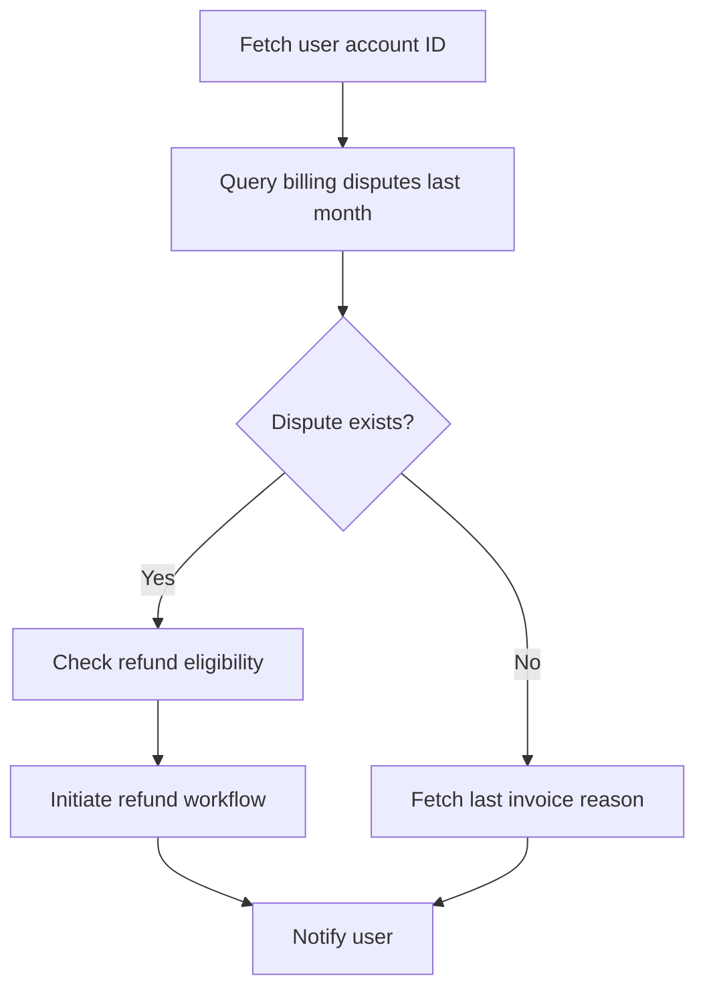

# Planner

> **Learning Path:** Agentic AI
> **Section:** 15.2.2 — Agent patterns

## 1. Problem

ஒரு agent-க்கு ஒரு user request வருது: "எனது கடந்த 6 மாத sales data எடுத்து, trend analyze பண்ணி, ஒரு PDF report generate பண்ணி, எனக்கும் finance team-க்கும் email அனுப்பு".

இதை ஒரே step-ல செய்ய முடியாது. 
Database query பண்ணனும், analysis பண்ணனும், file generate பண்ணனும், email அனுப்பனும்.

இங்கே என்ன problem வரும்?
* எந்த step முதல், எந்த step பிறகு?
* ஒரு step fail ஆனா என்ன பண்ணுறது?
* Tool A output format Tool B input-க்கு match ஆகுமா?
* User context மாறினா plan-ஐ எப்படி மாத்துறது?

Agent நேரடியா ஒவ்வொரு tool-ஐயும் random-ஆ call பண்ணினா, திசை தப்பும், loop பண்ணும், unnecessary calls பண்ணும். Cost உயரும், latency போகும்.

**Planner pattern தேவைப்படுவது இங்கே:** complex goal-ஐ decompose பண்ணி, ordered steps ஆக்கி, execution-க்கு தயார் பண்ண.

## 2. Mental Model

Planner = **Goal → Plan → Steps**.

ஒரு experienced engineer மாதிரி think பண்ணு. User request வந்ததும், agent உடனே tool-ஐ அடிக்காது. முதல் அது ஒரு internal thought process-ல plan போடும்.

Mental model:
```
User Intent
      ↓
Planner: decompose into sub-tasks
      ↓
Ordered plan with dependencies
      ↓
Executor: step-by-step run, observe, replan if needed
```

Planner என்பது strategist. Executor என்பது worker.

## 3. How It Works

Planner பொதுவா LLM-ஐயே use பண்ணும், ஆனா different prompt / reasoning mode-ல.

Input: user query + context + available tools
Output: structured plan

Plan format பொதுவா:
* Sub-goals list
* Dependencies between steps
* Required inputs/outputs per step
* Tool choice per step

Simple example:

**Step 1:** fetch sales data from database for last 6 months
**Step 2:** analyze trend using analysis tool
**Step 3:** generate PDF report from analysis
**Step 4:** send email to user and finance team with PDF attachment

Dependencies: Step 2 needs Step 1 output. Step 3 needs Step 2 output.

Planner இந்த order-ஐ explicit-ஆ generate பண்ணும். Executor அதை follow பண்ணும்.

நல்ல planner plans are **verifiable and editable**. Agent plan-ஐ user-க்கு காட்டி confirm வாங்கலாம், அல்லது mid-execution failure வந்தால் replan பண்ணலாம்.

## 4. Architectural Reasoning

Planner useful ஆகும் போது:

* **Multi-step tasks** with 3+ tools
* **Tool dependency** உள்ளது
* **Conditional branching** தேவை
* **Long horizon** tasks

Alternatives:

* **ReAct / Reflexion:** think-act loop, no explicit plan. Small tasks-க்கு நல்லது. ஆனா large tasks-ல wandering ஆகும்.
* **Router pattern:** request-ஐ classify பண்ணி right specialist agent-க்கு forward பண்ணும். Planning இல்ல.
* **Hierarchical agents:** Planner agent தனியா, Executor agents தனியா. Scale ஆகும்.

Architect ஏன் Planner தேர்வு பண்ணுவார்?
* Predictability தேவை. Steps transparent ஆக இருக்கும்.
* Cost control: unnecessary tool calls குறையும்.
* Observability: எந்த step fail ஆச்சுன்னு தெரியும்.

Trade-off: Planner add பண்ணினா latency அதிகரிக்கும், ஒரு extra LLM call வரும். Plan wrong ஆனா whole execution fail.

## 5. Trade-offs

**1. Planning accuracy vs flexibility**
Static plan போட்டா fast ஆனா mid-way context change வந்தால் adapt பண்ண முடியாது. Dynamic replanning தேவை, அது complexity அதிகரிக்கும்.

**2. Plan granularity**
Too fine-grained plan = too many steps, overhead. Too coarse = executor stuck. Sweet spot தேவை.

**3. Cost & Latency**
Planner = extra reasoning token. Simple task-க்கு overkill.

**4. Failure modes**
* Hallucinated tool
* Missing dependency
* Wrong order
* Plan too rigid, observation-ஐ ignore பண்ணும்

Planner should be paired with **Executor with feedback loop**. Step fail ஆனா planner-க்கு திருப்பி அனுப்பி replan பண்ண வேண்டும்.

## 6. Practical Example

Enterprise support agent.

User: "எனது account-ல last month billing dispute இருக்கா என்று பார்த்து, இருந்தா refund process start பண்ணு, இல்லைனா reason சொல்லு"

Planner generates:



Executor runs step by step. Step B return empty. Planner-ஐ re-evaluate பண்ணி branch to F.

இங்கே Planner இல்லாம ReAct முயற்சித்தால், agent முதலில் refund process தொடங்க முயற்சிக்கலாம், அது wrong action.

## 7. Reasoning Challenge

உங்களிடம் ஒரு RAG agent இருக்கு. User கேட்கிறார்: "எங்கள் product pricing policy மாற்றம் குறித்து கடந்த 1 வருஷத்தில் எல்லா internal docs-லும் தேடி, summary கொடு, முக்கியமான changes-ஐ highlight பண்ணு".

உங்களிடம் 3 tools உள்ளன: `search_vector_db`, `fetch_doc`, `summarize_text`.

இதற்கு நீங்கள் Planner use பண்ணுவீர்களா? இல்லை ReAct போதுமா? Plan-ன் 3 main steps என்னவாக இருக்கும்? Plan wrong ஆனால் என்ன failure வரும்?

## 8. Key Takeaways

* Planner = complex goals-ஐ ordered, dependent steps-ஆ மாற்றும் strategist layer
* Plan என்பது execution-க்கு முன் reasoning, not just tool calling
* Good plan = dependencies clear, verifiable, re-plannable
* Planner add பண்ணினால் predictability, cost control கிடைக்கும்; ஆனா latency & rigidity cost உண்டு
* Always pair Planner with Executor + feedback loop for real-world robustness
