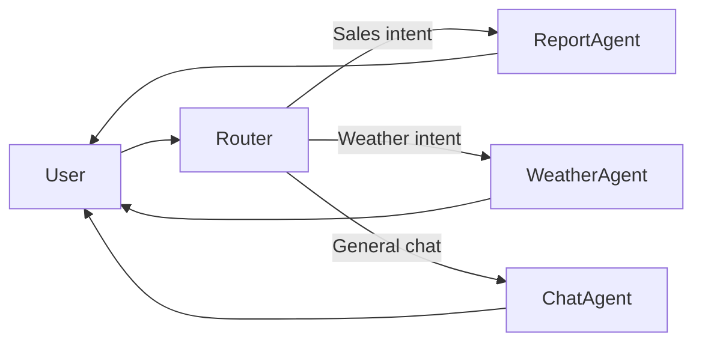

# Router

> **Learning Path:** Agentic AI
> **Section:** 15.2.4 — Agent patterns

## 1. Problem

உங்க Agentic AI system-ல ஒரு user query வருது.

> "எனக்கு கடந்த மாத sales report வேண்டும், அதை PDF-ஆ மாற்றி என் manager-க்கு mail பண்ணு"

இந்த ஒரே query-க்கு என்ன தேவை?

* Database-ல data fetch பண்ணணும்
* Report generate பண்ணணும்
* PDF convert பண்ணணும்
* Email send பண்ணணும்

ஒரே agent இதையெல்லாம் செய்ய முயற்சி பண்ணா என்ன ஆகும்? Prompt huge ஆகும், context window overflow ஆகும், tools எல்லாம் ஒன்னா கொடுத்தால் agent confuse ஆகும். Wrong tool தேர்ந்தெடுக்கும். Latency அதிகமாகும்.

அடுத்த query வந்தால்:

> "எனக்கு weather சொல்லு"

இதுக்கு database தேவையே இல்லை. ஒரே general agent எல்லாத்துக்கும் handle பண்ணுவது painful ஆகும்.

**Problem என்ன?** ஒரு input வந்தால், எந்த specialized agent-க்கு அதை கொடுக்கணும், எந்த tool-ஐ use பண்ணணும், எந்த workflow-ல போகணும் என்பதை தீர்மானிக்கணும்.

Router இல்லாமல் agent system-ல confusion, slow response, error rate அதிகம் ஆகும்.

## 2. Mental Model

Router என்பது **traffic police** மாதிரி.

User request வந்ததும் அதை பார்த்து, intent புரிஞ்சுக்கிட்டு, சரியான destination-க்கு forward பண்ணுவது.

இது ஒரு meta-agent. இது காரியத்தை செய்யாது, எங்கே போகணும் என்று முடிவு செய்யும்.

அதனால் Router = **Classification + Dispatch**.

## 3. How It Works

பொதுவாக 3 step.

1. **Input Understanding**: User query-ஐ parse பண்ணு. Intent, entities, complexity extract பண்ணு.
2. **Routing Decision**: உங்க agent graph-ல எந்த agent தகுதியானது என்பதை தேர்வு செய். இது rule-based ஆகவும் இருக்கலாம், LLM-based classifier ஆகவும் இருக்கலாம்.
3. **Dispatch**: Request + context-ஐ சரியான agent/tool-க்கு அனுப்பு.

Mermaid:

Simple case-ல Router ஒரு LLM-ஐ prompt பண்ணி: "Given this query, choose one of [ReportAgent, WeatherAgent, ChatAgent]". Output ஒரு routing decision.

More advanced-ல Router-க்கு own tool இருக்கும்: user profile, history, cost, latency metrics பார்த்து route பண்ணும்.

## 4. Architectural Reasoning

**When useful?**

* Multi-agent system உள்ளபோது
* Tools / skills நிறைய இருக்கும்போது
* Query type வெவ்வேறு complexity உள்ளபோது

**Constraint it addresses**: Single agent-ஆல் எல்லாவற்றையும் செய்ய முடியாது. Specialization தேவை.

**Alternatives**:

* **Monolithic Agent**: எல்லா tools-உம் ஒரே agent-க்கு. Simple ஆனால் scale ஆகாது.
* **Hierarchical Agents**: Router தேவையில்லாமல் parent agent முடிவு பண்ணும். Tight coupling ஆகும்.
* **Static Rules**: Regex / keyword match. Cheap ஆனால் brittle.

Router தேர்வு செய்யும் போது reason:

* **Correctness**: சரியான agent-க்கு போனால் தான் output quality வரும்
* **Cost**: Cheap agent-க்கு simple query போக வேண்டும், expensive LLM-க்கு complex query மட்டும்
* **Latency**: Real-time query-க்கு fast path, batch query-க்கு slow path
* **Operability**: Each agent-ஐ independent-ஆ deploy, monitor, scale பண்ண முடியும்

## 5. Trade-offs

**Routing accuracy vs cost**: LLM router accurate ஆனால் extra LLM call cost. Rule-based cheap ஆனால் miss பண்ணும்.

**Central bottleneck**: Router எல்லா request-உம் பார்க்கும். அது slow ஆனால் whole system slow.

**Error propagation**: Router தவறாக route பண்ணினால், downstream agent சரியான output கொடுக்காது. Failure mode silent.

**Dynamic learning**: User behavior மாறும்போது router-ஐ retrain / update பண்ண வேண்டும். Stale routing rules create drift.

## 6. Practical Example

Enterprise support Agentic AI.

Agents:

* `BillingAgent` - invoices, refunds
* `TechSupportAgent` - outage, connectivity
* `SalesAgent` - quotes, product info
* `EscalationAgent` - human handoff

Router LLM prompt:

> Classify intent into billing/tech/sales/escalation. Also check sentiment and SLA.

Query: "My internet is down since morning and I can't access the dashboard, this is affecting my business"

Router: TechSupportAgent-க்கு route. Priority high. SLA < 5 min.

Query: "Can you send me last month invoice and also I want to upgrade plan"

Router: Multi-step. First BillingAgent, then SalesAgent. அல்லது Orchestrator-க்கு route.

Router இங்கே tool use பண்ணி user tier பார்த்து, premium user ஆனால் direct EscalationAgent-க்கு route பண்ணும்.

## 7. Reasoning Challenge

உங்களிடம் 3 agents இருக்கு:

* `FastCheapAgent` - 200ms, $0.001 per call, accuracy 80%
* `SlowAccurateAgent` - 2s, $0.02 per call, accuracy 95%
* `SpecialistAgent` - 1s, $0.01 per call, domain-specific

User query வரும். 70% queries simple FAQ, 20% complex reasoning, 10% domain-specific.

நீங்கள் Router-ஐ எப்படி design பண்ணுவீர்கள்? Cost, latency, accuracy trade-off-ஐ எப்படி balance பண்ணுவீர்கள்? Router தவறாக route பண்ணினால் என்ன fallback இருக்கும்?

## 8. Key Takeaways

* Router agent-ஐ செய்யாது, எங்கே போகணும் என்று முடிவு செய்யும்
* Specialization, cost control, latency control-க்கு Router தேவை
* Routing decision தவறினால் whole system தவறும், அதனால் accuracy முக்கியம்
* Router itself ஒரு architectural trade-off: accuracy vs cost vs complexity

இப்போ Router ஏன் தேவைன்னு புரியுது, எப்போ use பண்ணணும்னு தெரியும்.
