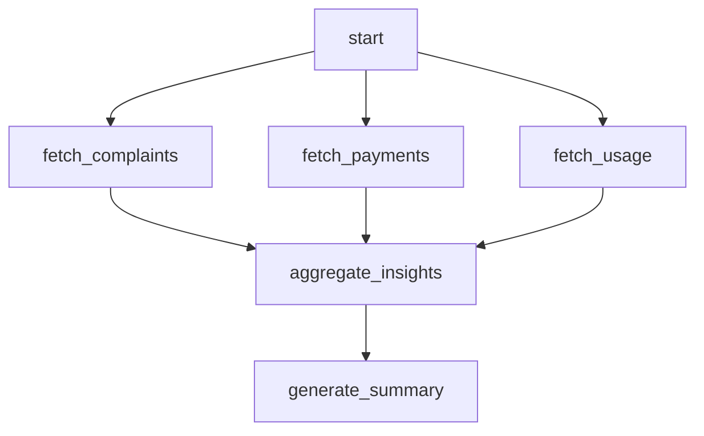

# Parallel execution

> **Learning Path:** AI Orchestration
> **Section:** 17.1.11 — LangGraph concepts

## 1. Problem

ஒரு AI agent-க்கு ஒரு user query வருது. அதை solve பண்ண நிறைய independent steps தேவை.

உதாரணமா, `user: "இந்த quarter sales report-ஐ analyze பண்ணி, top 3 reasons for drop-ஐ சொல்லு, மேலும் email draft-ஆக தயார் பண்ணு"`

இங்கே என்ன நடக்கணும்?
1. Sales data-வை fetch பண்ணணும்
2. Market data-வை fetch பண்ணணும்
3. Competitor data-வை fetch பண்ணணும்
4. மூன்றையும் analyze பண்ணி insights generate பண்ணணும்
5. Email draft generate பண்ணணும்

Steps 1,2,3 ஒன்னுக்கொன்னு depend இல்ல. எல்லாம் parallel-ஆ run பண்ணலாம். ஆனால் step 4 க்கு 1,2,3 எல்லாம் முடிஞ்சிருக்கணும்.

ஒரு sequential chain-ல run பண்ணினால் என்ன ஆகும்? 3 API calls ஒன்னுக்கு பின் ஒன்னு. Latency கூடும். User wait time அதிகமாகும். Resource idle ஆகும்.

இங்கே பெயின் பாய்ண்ட்: **Independent work-ஐ serial-ஆ wait பண்ணுவது waste.**

LangGraph-ல இதை handle பண்ண parallel execution concept வருது.

## 2. Mental Model

Parallel execution என்பது ஒரே நேரத்தில் ஒன்றுக்கு மேற்பட்ட independent nodes-ஐ run பண்ணுவது.

Mental model: ஒரு manager-க்கு 3 different reports தேவை. அவர் ஒரே ஆளை serial-ஆ அனுப்பாமல் 3 ஆட்களை ஒரே நேரத்தில் அனுப்புவார். எல்லா reports வந்ததும் மட்டும் final decision எடுப்பார்.

LangGraph-ல இது Fan-out → Fan-in pattern.

## 3. How It Works

LangGraph-ல `StateGraph` ஒரு node-ல இருந்து பல branches-க்கு go பண்ணலாம். அவை parallel-ஆ run ஆகும்.

Basic flow:

`start → fetch_sales | fetch_market | fetch_competitor → analyze → end`

`|` என்பது parallel split.

Graph compile ஆனதும், LangGraph runtime ஒவ்வொரு branch-ஐயும் independent-ஆ execute பண்ணும். State object shared ஆகும். ஒவ்வொரு node-ம் state-ஐ read/write பண்ணும்.

Fan-in node `analyze` என்பது 3 branches எல்லாம் முடிந்த பிறகு தான் trigger ஆகும். அதாவது join condition.

Implementation-ல `add_edge` multiple edges set பண்ணுவது போதும். LangGraph automatically parallel-ஆ schedule பண்ணும்.

## 4. Architectural Reasoning

Parallel execution useful ஆகும் போது:

* **Independent I/O bound tasks**: API calls, DB queries, vector search. Latency hide பண்ணலாம்.
* **Multiple tools**: Same query-க்கு different tools-ல facts collect பண்ணணும்.
* **Ensemble reasoning**: Multiple LLM agents ஒரே prompt-ஐ வெவ்வேறு angle-ல solve பண்ணி, பிறகு combine பண்ணுவது.

Constraint it addresses: **Total latency = max(branch latencies) not sum.**

Alternatives:
* Sequential chain: Simple, deterministic, debugging easy. ஆனால் slow.
* Async loop in single node: Code-ல manage பண்ணலாம், ஆனால் graph readability குறையும்.
* Separate services: Overkill for small parallelism.

Architect choose பண்ணுவது ஏன்? Because user experience matters. Agent response time 15 sec vs 5 sec difference. Parallel execution cost அதிகம் ஆனால் latency குறைக்கும்.

## 5. Trade-offs

* **Latency vs Cost**: Parallel-ல 3 LLM calls ஒரே நேரத்தில். Cost 3x, but time ~1x. Budget vs UX trade-off.
* **State contention**: Multiple nodes same state field-ஐ write பண்ணினால் race condition. Design state clearly: each node writes to its own key.
* **Error handling complexity**: ஒரு branch fail ஆனால் என்ன பண்ணுவது? Fail fast? Continue with partial data? LangGraph-ல `interrupt` and retry logic தேவை.
* **Ordering not guaranteed**: Parallel branches return order unpredictable. Fan-in node must not assume order.
* **Resource saturation**: Too much parallelism = too many concurrent API calls. Rate limits, timeouts hit ஆகும். Need concurrency limiter.

Failure mode: One branch hangs. Whole join wait ஆகும். Timeout per branch set பண்ண வேண்டும்.

## 6. Practical Example

Enterprise support agent.

User: "இந்த customer-க்கு கடந்த 6 மாத complaint history, payment history, மற்றும் product usage pattern சொல்லு"

Graph:

`fetch_complaints`, `fetch_payments`, `fetch_usage` மூன்றும் independent. Parallel-ஆ run ஆகும். State-ல `complaints`, `payments`, `usage` keys தனித்தனியாக fill ஆகும்.

`aggregate_insights` node மூன்றும் ready ஆனதும் trigger ஆகி final summary generate பண்ணும்.

இது real system-ல 2-3 seconds save பண்ணும்.

## 7. Reasoning Challenge

உங்களிடம் ஒரு RAG pipeline இருக்கு. ஒரு query-க்கு 3 different vector stores-ல search பண்ணணும்: internal docs, public web, code repo. மூன்றும் independent. ஒரு branch fail ஆனால் மற்ற இரண்டு results-ஐ வைத்து answer generate பண்ணலாம்.

இங்கே parallel execution use பண்ணுவீர்களா? Fan-in node-ல partial failure-ஐ எப்படி handle பண்ணுவீர்கள்? Retry பண்ணுமா? Skip பண்ணுமா?

சிந்தித்து பாருங்கள்.

## 8. Key Takeaways

* Parallel execution = independent branches-ஐ ஒரே நேரத்தில் run பண்ணி latency குறைப்பது.
* Fan-out → Fan-in என்பது LangGraph-ல core pattern for parallel work.
* Use it for independent I/O bound tasks, not for dependent logic.
* Trade-off: Latency குறையும், cost & complexity அதிகரிக்கும்.
* State design முக்கியம்: எந்த node என்ன key-ஐ touch பண்ணும் என்பதை தெளிவாக வைக்கவும்.
