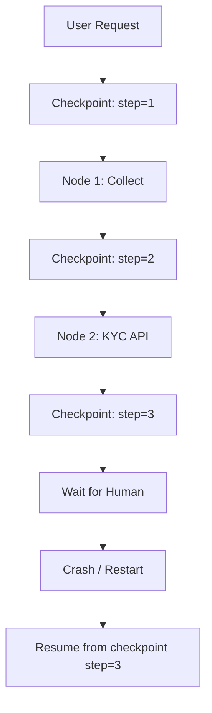

# Durable execution

> **Learning Path:** AI Orchestration
> **Section:** 17.1.14 — LangGraph concepts

## 1. Problem

நீங்கள் ஒரு AI agent-ஐ build பண்ணீங்க. அது multiple steps-ல run ஆகும்: tool call பண்ணும், LLM-ஐ call பண்ணும், database-ஐ update பண்ணும்.

இதுல ஒரு step-ல network failure வந்துடுச்சு. அல்லது pod crash ஆயிடுச்சு. அல்லது user தூங்கிட்டு 10 நிமிஷம் கழித்து திரும்ப வந்தார்.

இப்போ என்ன ஆகும்?

Current execution state எல்லாம் மறைஞ்சிடும். எந்த step-ல இருந்தோம், என்ன data இருந்தது, next என்ன பண்ணனும் — எதுவும் தெரியாது.

Engineer-க்கு வரும் pain:

* Retry பண்ணினால் முழு workflow முதல்ல இருந்து start ஆகும். Duplicate tool calls, duplicate payments.
* User-க்கு "continue" option இல்லை. இணைப்பு துண்டிக்கப்பட்டால் process dead.
* Long-running workflow-களை horizontally scale பண்ண முடியாது. ஒரு instance-ல memory-ல தான் state இருக்கு.

**"What goes wrong if we don't have this?"** — State ephemeral ஆக இருக்கும். Failure = data loss + wasted work.

## 2. Mental Model

Durable execution என்பது **state-ஐ external-ஆக persist பண்ணி, execution-ஐ checkpoint பண்ணி, crash ஆனாலும் அதே இடத்தில் இருந்து தொடர வைக்கும்** concept.

ஒரு notebook-ல எழுதுற மாதிரி. ஒவ்வொரு step முடிந்ததும் page-ஐ save பண்ணீங்க. Power cut ஆனாலும், மீண்டும் அந்த page-ல இருந்து தொடரலாம்.

LangGraph-ல இது graph node execution-ஐ durable ஆக்குறது. Each node run = a checkpoint.

## 3. How It Works

Simple mental flow:

1. **Before node runs** → current state, inputs, next node decision ஆகியவற்றை checkpoint store-ல save பண்ணு.
2. **Node runs** → tool call, LLM call முடியும்.
3. **After node succeeds** → updated state-ஐ persist பண்ணு, next node-க்கு move பண்ணு.
4. **Failure / crash** → last successful checkpoint-ல இருந்து resume பண்ணு. Idempotent node-கள் மட்டும் re-run.

Checkpoint store என்பது typically database. LangGraph-ல Postgres, Redis, SQLite options உண்டு.

Key idea: **execution = state machine**. State machine-ன் current pointer மட்டும் persist ஆனால் போதும்.

## 4. Architectural Reasoning

இது எப்போ useful?

* Workflow 1 step-க்கு மேல் ஆகும், steps ஒன்றுக்கொன்று dependent.
* External calls உள்ளன: API, tool, LLM. அவை slow, flaky.
* User interaction தேவைப்படும்: human-in-the-loop, approval.
* Long-running: minutes to hours.

Constraint இது address பண்ணும்: **availability vs correctness under failure**.

Alternatives:

* In-memory state + retry whole workflow. Simple but wasteful, non-durable.
* Manual state tracking with DB writes in application code. Works but boilerplate அதிகம், bugs வரும்.
* Durable execution framework: state management, checkpointing, resume logic built-in.

Architect ஏன் choose பண்ணுவார்? Because team size சிறியது, operational complexity குறைக்கணும், மற்றும் correctness முக்கியம். Payment, booking போன்ற flows-ல duplicate run கூடாது.

## 5. Trade-offs

**Durability vs Latency:** ஒவ்வொரு step-க்கும் DB write வரும். Throughput குறையும். Async checkpointing உடன் trade-off பண்ணலாம்.

**Complexity vs Safety:** Checkpoint store, replay logic maintain பண்ணணும். Schema evolve ஆனால் old checkpoints migrate பண்ண வேண்டும்.

**Cost:** Storage grow ஆகும். Long-running workflows-க்கு checkpoint retention policy வேண்டும்.

**Failure modes:** Checkpoint store itself down ஆனால் execution stuck. So checkpoint store-க்கு high availability வேண்டும். Also non-idempotent side effects: tool already called, database updated. Resume பண்ணும்போது duplicate side effect வரும். இதற்கு idempotency keys, outbox pattern பயன்படுத்த வேண்டும்.

## 6. Practical Example

Enterprise onboarding agent:

Step 1: Collect user details
Step 2: Call KYC API
Step 3: Wait for human approval
Step 4: Provision account in database
Step 5: Send welcome email

User step 3-ல approve பண்ண 2 மணி நேரம் கழித்து வருவார். இடையில் service restart ஆகி இருக்கும்.

Durable execution இருந்தால்: checkpoint store-ல last completed node = Step 2. Resume ஆனதும் Step 3-ல இருந்து தொடரும். KYC API-ஐ மீண்டும் call பண்ணாது.

இல்லாமல்: முதலில் இருந்து தொடங்கும். KYC API rate limit hit ஆகும். User குழப்பம்.

Mermaid flow:

## 7. Reasoning Challenge

உங்களிடம் 20 consumers இருக்கு. எல்லாருக்கும் same event தேவை. Consumer processing speed வேறுபடுகிறது. Producer-ஐ block பண்ணக்கூடாது. Replay-ம் வேண்டும்.

Wait, இது event streaming. சரி.

Durable execution scenario:

உங்களிடம் ஒரு loan approval workflow உள்ளது. 5 steps. Step 3-ல credit bureau API call பண்ணி response வர 30 sec ஆகும். இந்த API timeout ஆனால், workflow crash ஆகும். Client retry பண்ணும்போது அதே API மீண்டும் call ஆகி double charge ஆகும்.

Durable execution உடன் என்ன மாற்றம் செய்வீர்கள்? Checkpoint எங்கே வைப்பீர்கள்? Idempotency எப்படி handle பண்ணுவீர்கள்?

## 8. Key Takeaways

* Durable execution = state persistence + checkpoint + resume. Ephemeral memory-ல இருந்து external store-க்கு move பண்ணுது.
* Failure வந்தாலும் work lost ஆகாது, duplicate work தவிர்க்கலாம். Idempotent nodes மட்டும் re-run ஆகும்.
* Cost: latency, storage, operational complexity அதிகரிக்கும்.
* Architectural decision: long-running, multi-step, external calls உள்ள agent flows-க்கு மட்டுமே தேவை. Simple request-response-க்கு overkill.
