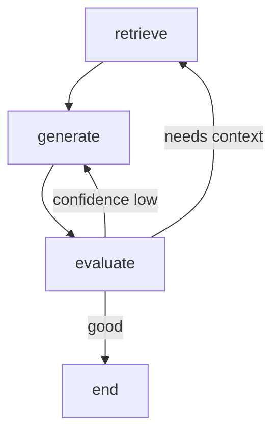

# Edges

> **Learning Path:** AI Orchestration
> **Section:** 17.1.3 — LangGraph concepts

## 1. Problem

நீங்கள் ஒரு agent workflow build பண்ணிக்கொண்டிருக்கிறீர்கள். Nodes என்பது வேலை செய்யும் steps: LLM call, tool call, validation, etc.

இப்போது கேள்வி வருகிறது: **அடுத்து எந்த node-க்கு போக வேண்டும்?**

எல்லாம் ஒரே வரிசையில் போகுமா? இல்லை input-ஐ பொறுத்து மாறுமா? ஒரு condition திருப்தி ஆனால் மட்டும் tool use பண்ண வேண்டுமா? Error வந்தால் retry செய்ய வேண்டுமா? Loop பண்ண வேண்டுமா?

எட்ஜ் இல்லாமல் இதை நீங்கள் control பண்ண முடியாது. Edges தான் graph-ன் flow-ஐ define பண்ணுகிறது.

## 2. Mental Model

LangGraph-ல் graph என்பது **nodes + edges** இன் combination.

Node = ஒரு function / work unit.
Edge = **எப்போது, எங்கே போக வேண்டும்** என்பதற்கான decision logic.

Simple analogy: Node என்பது city. Edge என்பது road with traffic signal. Signal-ன் condition தான் edge.

## 3. How It Works

LangGraph-ல் முக்கியமாக இரண்டு வகை edges உண்டு.

**1. Static Edge**
`add_edge("A", "B")`
எப்போதும் A முடிந்ததும் B-க்கு போகும். No condition.

**2. Conditional Edge**
`add_conditional_edges("A", route_fn, { "yes": "B", "no": "C" })`

A node run ஆன பிறகு `route_fn` என்ற function run ஆகும். அது state-ஐ பார்த்து "yes" அல்லது "no" return பண்ணும். அதற்கு ஏற்ப B அல்லது C-க்கு போகும்.

இதுதான் architecturally powerful part. Conditional edge-ன் route function-க்கு முழு state access உண்டு. அதனால்:

* LLM output-ஐ parse பண்ணி அடுத்த step decide பண்ணலாம்
* Retry count பார்த்து loop-க்குள் வைக்கலாம்
* Tool result success/failure பார்த்து alternative path எடுக்கலாம்

LangGraph இதை deterministic-ஆக track பண்ணுகிறது. State machine போல.

## 4. Architectural Reasoning

Edges எதற்கு தேவை?

**Problem → Constraints → Options**

Problem: Multi-step reasoning with branching.
Constraint: Workflow dynamic ஆக இருக்க வேண்டும், ஆனால் observable & replayable ஆகவும் இருக்க வேண்டும்.

Options:
* Hardcode if-else in a single node → spaghetti, test பண்ண கஷ்டம்
* External orchestrator → latency, state sync problem
* Graph with edges → explicit flow, each node single responsibility

ஆர்கிடெக்ட் ஏன் edges-ஐ தேர்வு செய்வார்?
Because flow-ஐ **declarative** ஆக define பண்ண முடியும். Debugging, visualization, and replay எளிது. `get_graph()` என்றால் flow diagram கிடைக்கும்.

When useful:
* Agent loop: think → tool → validate → loop until answer good enough
* Human-in-the-loop: condition திருப்தி இல்லை என்றால் human node-க்கு divert
* Error handling: failure node-க்கு route பண்ணி retry/backoff

## 5. Trade-offs

**1. Complexity vs Flexibility**
Conditional edges flexible ஆனால் route function-ல் logic வைத்தால் graph understand பண்ண கஷ்டம். Route logic ரொம்ப complex ஆனால், அது ஒரு node ஆக split பண்ணலாம்.

**2. Determinism vs Non-determinism**
LangGraph edges deterministic path-ஐ assume பண்ணும். LLM output non-deterministic ஆக இருந்தால், route function-ல் parsing fail ஆகலாம். அதற்கு guardrails வேண்டும்.

**3. Loop & Termination**
Loop எடுக்க எடுக்க state மாறாமல் இருந்தால் infinite loop. Architect-ஆக நீங்கள் max iterations, state change check போன்ற termination condition வைக்க வேண்டும்.

**4. Observability**
Edges explicit ஆக இருப்பதால் tracing easy. ஆனால் dynamic branching அதிகமானால் execution paths exponential-ஆக increase ஆகும். Testing முக்கியம்.

## 6. Practical Example

RAG agent workflow.

Nodes:
* `retrieve` - vector database-ல் search
* `generate` - LLM-ல் answer generate
* `evaluate` - answer quality check
* `end`

Edge flow:
`retrieve -> generate -> evaluate`

`evaluate` node-ல் route function:
```
if confidence < 0.7:
   return "retry"
elif needs_more_context:
   return "retrieve"
else:
   return "end"
```

Conditional edges:
`add_conditional_edges("evaluate", route_fn, {"retry":"generate","retrieve":"retrieve","end":"end"})`

இங்கே edge தான் loop-ஐ control பண்ணுகிறது. Producer block ஆகாமல், consumer speed-ஐ பொறுத்து flow மாறும்.

Mermaid:


## 7. Reasoning Challenge

உங்களிடம் ஒரு customer support agent உள்ளது. Flow: `classify -> retrieve -> generate -> check_sentiment`.

Requirement:
* Sentiment negative ஆனால் `escalate_to_human` node-க்கு போக வேண்டும்
* Sentiment neutral/positive ஆனால் `end`
* `retrieve` result empty ஆனால் `generate` skip பண்ணி `ask_clarification` node-க்கு போக வேண்டும்

இந்த branching-ஐ எந்த nodes-க்கு conditional edge வைப்பீர்கள்? Route function-ன் input என்னவாக இருக்க வேண்டும்? Infinite loop எப்படி தடுப்பீர்கள்?

## 8. Key Takeaways

* Edges தான் LangGraph-ல் flow control-ஐ கொடுக்கிறது. Node என்ன செய்யும் என்பது node, எப்போது போகும் என்பது edge.
* Conditional edges மூலம் state-based routing செய்யலாம். அதுவே agent loop-ன் core.
* Every branching increases testing surface. Route logic simple & testable ஆக வைத்துக்கொள்ளுங்கள்.
* Loop-க்கு termination condition கண்டிப்பாக வேண்டும், இல்லையெனில் cost & latency blow up ஆகும்.
