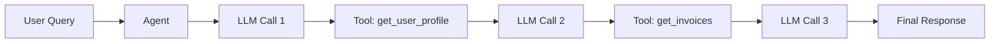

# Tool traces

> **Learning Path:** LLMOps / AI Observability
> **Section:** 19.1.10 — Observability

## 1. Problem

உங்களிடம் ஒரு agent இருக்கு. அது user query-க்கு பதில் கொடுக்குறதுக்கு முன்னாடி 3-4 tools-ஐ call பண்ணுது: `search_web`, `get_user_profile`, `call_weather_api`. 

User சொன்னார் "response weird ah இருக்கு". உங்களுக்கு என்ன தெரியும்? Agent என்ன tool-ஐ call பண்ணிச்சு? எந்த parameter கொடுத்துச்சு? Tool return பண்ணினது சரியா? எந்த step-ல latency வந்தது? Error எங்கே வந்தது?

Logs-ல "tool called" என்று மட்டும் இருந்தால் போதாது. LLM thought process + tool input/output + timing எல்லாம் சேர்ந்து ஒரு trace இல்லாமல், production agent-ஐ debug பண்ணுவது blind flight போல.

**What goes wrong if we don't have this?**
- Flaky responses-க்கு root cause கண்டுபிடிக்க முடியாது.
- Hallucination vs bad tool data என்று differentiate பண்ண முடியாது.
- Cost ஏன் அதிகமாகுதுன்னு தெரியாது.
- Retry, timeout, rate limit எங்கே நடக்குதுன்னு தெரியாது.

## 2. Mental Model

Tool trace என்பது ஒரு agent execution-ன் **structured execution log**.

ஒரு request ஆரம்பிச்சதில் இருந்து முடிஞ்சதுவரை: 
`user input → LLM decision → tool call #1 → tool response → LLM decision → tool call #2 → ... → final answer`

ஒவ்வொரு step-உம் என்ன input, என்ன output, எவ்வளவு time எடுத்தது, success/failure, என்ன cost ஆச்சு என்பதை capture பண்ணுவது.

இது distributed system-ல distributed tracing போல. Service A service B-ஐ call பண்ணும்போது trace ID propagate பண்ணுவோமே, அதே concept. இங்கே service என்பது LLM + tools.

## 3. How It Works

Minimal trace என்பது:

* **trace_id / run_id**: ஒரு user request-க்கு unique id
* **spans**: ஒவ்வொரு step-க்கும் ஒரு span
  * `llm_call`: prompt, model, tokens in/out, latency, cost
  * `tool_call`: tool name, input arguments, output, latency, status
  * `agent_step`: reasoning summary, chosen action

இதை capture பண்ண:
1. Agent framework இல் instrumentation hook போடு
2. Tool call முன்னும் பின்னும் span start/stop பண்ணு
3. Context propagation: trace_id-ஐ tool call-ல் header ஆக pass பண்ணு
4. Export to observability backend: OpenTelemetry, LangSmith, Arize, Datadog

உதாரணமாக:
```
trace_id: abc123
span: llm_call_1 | duration 1.2s | tokens 400
span: tool_call_search_web | input {query:"..."} | output 3 results | duration 0.8s | status ok
span: llm_call_2 | duration 0.9s
```

## 4. Architectural Reasoning

**When this becomes useful**
* Agent production-ல deploy ஆனதும்
* Multi-tool, multi-step workflows
* RAG + tools கலந்த system
* Cost control முக்கியம்

**What constraint it addresses**
Reliability + debuggability + cost observability.

**Alternatives**
* Plain logs: unstructured, correlate பண்ண கஷ்டம்
* Only LLM metrics: tool failures தெரியாது
* Manual replay: non-deterministic

Tool traces help decide:
* எந்த tool அடிக்கடி fail ஆகுது?
* எந்த step-ல latency bottleneck?
* எந்த prompt pattern-ல tool misuse நடக்குது?

## 5. Trade-offs

* **Verbosity vs privacy**: Tool input/output-ல PII வரலாம். Mask/filter செய்யணும்.
* **Performance overhead**: Span capture, serialization கொஞ்சம் latency சேர்க்கும். Sampling தேவைப்படலாம்.
* **Storage cost**: ஒரு request-க்கு MB level data. Retention policy வேணும்.
* **Schema drift**: Tool definitions மாறினால் trace schema evolve ஆகும்.

Failure mode: Trace-ஐ capture பண்ணாமல் tool error swallow ஆகி, agent generic apology கொடுக்கும்.

## 6. Practical Example

Enterprise support agent.

User: "என் last invoice amount என்ன?"

Agent:
1. llm_call → decide to call `get_user_profile` + `get_invoices`
2. tool_call get_user_profile → success 120ms
3. tool_call get_invoices → timeout after 5s, retry once, success
4. llm_call → generate answer

Tool trace-ல பார்த்தால் invoice service-ல latency spike தெரியும். 2 PM-க்கு மேல் p95 4s ஆகுது. அது DB connection pool exhaustion.

இல்லாமல் இருந்தால், "agent slow" என்று மட்டும் தெரியும். Trace இருந்தால் root cause தெரியும்.

Mermaid flow:


## 7. Reasoning Challenge

உங்களிடம் 20% requests-ல agent தவறான tool arguments கொடுத்து fail ஆகுது. Tool traces இருக்கு. நீங்கள் எந்த மெட்ரிக் முதலில் பார்ப்பீர்கள்? Tool failure rate by tool? LLM output schema validation? அல்லது prompt version vs error rate correlation?

ஏன்?

## 8. Key Takeaways

* Tool trace என்பது agent execution-ன் distributed trace. Debug, reliability, cost-க்கு தேவை.
* LLM call + tool call + timing + input/output எல்லாம் ஒரே trace_id-ல link ஆகணும்.
* Trace இல்லாமல் production agent என்பது black box.
* Capture பண்ணும்போது privacy, cost, sampling trade-off-ஐ முடிவு செய்யணும்.
