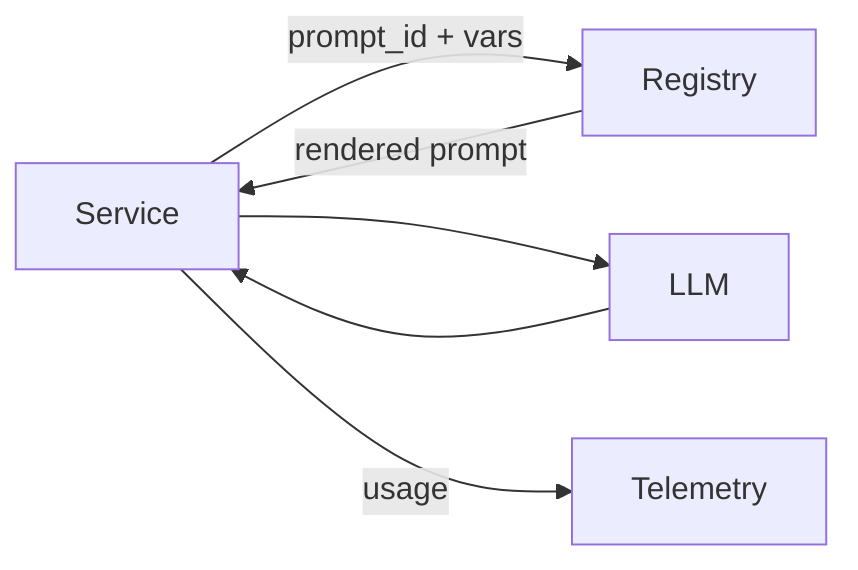

# Prompt registry

> **Learning Path:** Enterprise AI Architecture
> **Section:** 23.1.4 — Enterprise patterns

## 1. Problem

Enterprise AI Architecture-ல் நீங்கள் 5-10 services-ல் LLM பயன்படுத்துகிறீர்கள். ஒவ்வொரு service-லும் prompt-கள் hard-coded ஆக இருக்கு.

ஒரு நாள் product team சொல்கிறது: "Agent-ன் tone-ஐ மாற்றணும், safety check-ஐ கண்டிப்பாக சேர்க்கணும்."

என்ன ஆகும்?
* 12 repos-ல் கைமுறையாக prompt மாற்றம்
* யார் எந்த version-ஐ use பண்றாங்கன்னு தெரியாது
* A/B test செய்ய முடியாது
* Prompt change deploy பண்ணணும் என்றால் full service redeploy தேவை
* Audit-க்கு prompt history கிடைக்காது

Pain point clear: **Prompt என்பது code அல்ல, ஆனால் code போல் treat செய்யப்படுகிறது.**

## 2. Mental Model

Prompt registry என்பது prompts-க்கான configuration store + version control system.

Database-க்கு schema registry இருப்பது போல, prompts-க்கு central registry இருக்கிறது.

ஒரு service தனது request-ஐ அனுப்பும்போது: `prompt_id = "customer_support_v3", variables = {...}` என்று குறிப்பிடுகிறது. Registry prompt template-ஐ திருப்பி தருகிறது, service அதை render செய்கிறது.

Prompt-கள் data ஆக மாறுகின்றன, code ஆக இல்லை.

## 3. How It Works

ஒரு minimal registry இதை செய்கிறது:

* **Store**: prompt template, system message, few-shot examples, output schema, guardrails
* **Versioning**: v1, v2 immutable. Rollback செய்யலாம்
* **Metadata**: owner, tags, model binding, temperature, max_tokens, allowed tools
* **Routing**: request context-ஆல் prompt தேர்வு. e.g., `locale=ta` → Tamil prompt variant
* **Observability**: prompt_id ஐ trace-ல் attach செய்து latency, cost, quality metrics collect செய்யலாம்

Flow:

Service-ல் prompt logic இல்லை, registry reference மட்டும் இருக்கிறது.

## 4. Architectural Reasoning

எப்போது தேவை?

* பல teams, பல services ஒரே LLM capability-ஐ reuse செய்யும்போது
* Prompt-கள் frequent iteration தேவைப்படும்போது, model change போல்
* Compliance / audit தேவைப்படும்போது
* A/B testing, canary release செய்ய வேண்டும்போது

Alternatives:

* **Hard-coded in service**: வேகமான start-க்கு okay, ஆனால் scale ஆகாது
* **Config file / feature flag**: simple, ஆனால் versioning, governance இல்லை
* **Prompt registry**: centralized governance + versioning + observability

Architect ஏன் choose பண்ணுவார்?
Prompt என்பது product logic. Product manager prompt-ஐ tweak செய்ய வேண்டும், engineer deploy செய்ய வேண்டாம்.

## 5. Trade-offs

* **Latency vs freshness**: Registry call செய்வது extra network hop. Cache செய்யலாம், ஆனால் cache invalidation தேவை.
* **Centralization vs autonomy**: Central team control செய்கிறது, ஆனால் team-கள் experiment செய்வது slow ஆகலாம். Solution: namespace + ownership model.
* **Complexity vs consistency**: Registry என்பது ஒரு new dependency. Registry down ஆனால் prompts கிடைக்காது. Fallback to local cache வேண்டும்.
* **Cost of governance**: Prompt review, testing pipeline தேவை. அதிக overhead, ஆனால் production incident குறையும்.

Important failure mode: Prompt drift. Registry-ல் v4 deploy ஆனது, ஆனால் சில services cache-ல் v3 use செய்கின்றன. Version pinning + rollout monitoring முக்கியம்.

## 6. Practical Example

Enterprise customer support agent.

3 teams: Chat, Email, Voice.

அனைவருக்கும் base prompt ஒன்று: policy, tone, escalation rules.

Registry-ல் `support_base_v2` உள்ளது.

Chat team தனது variant `support_base_v2.chat` உருவாக்கி, few-shot examples சேர்க்கிறது.
Email team `support_base_v2.email` உருவாக்குகிறது.

Product wants softer tone for premium customers.

Registry-ல் new version `support_base_v3` create செய்யப்படுகிறது. 10% traffic-க்கு route செய்து CSAT measure செய்யப்படுகிறது.

No code deploy. Only prompt_id change via config.

Audit log-ல் எந்த prompt version எப்போது use ஆனது என்று தெரியும்.

## 7. Reasoning Challenge

உங்களிடம் ஒரு RAG agent உள்ளது. Prompt-ல் system message + retrieved context + user query concatenate செய்யப்படுகிறது.

Retrieved context size மாறுகிறது. Prompt token limit exceed ஆகிறது.

Registry-ல் prompt template இருக்கிறது, ஆனால் context truncation logic service-ல் இருக்கிறது.

இதை எப்படி மேலாண்டு registry-ல் கொண்டு வருவீர்கள்? Prompt versioning-ஐ எப்படி design செய்வீர்கள்?

நினைத்துப் பாருங்கள்: prompt என்பது static text அல்ல, dynamic assembly rules-உம் சேர்ந்தது.

## 8. Key Takeaways

* Prompt-கள் code அல்ல, configuration data. அவற்றை centralize செய்தால் governance கிடைக்கும்.
* Registry prompt-ஐ version, route, observe செய்ய வைக்கிறது, service deploy தேவையில்லாமல்.
* Trade-off என்பது latency, dependency, operational complexity. Cache + fallback தேவை.
* Prompt changes-க்கு architectural decision support தேவை: who owns, how test, how roll out, how rollback.
