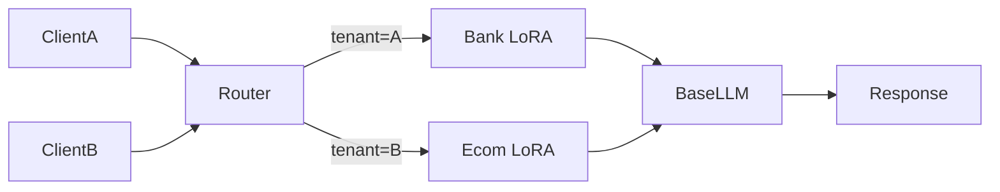

# Tenant-specific models

> **Learning Path:** Enterprise AI Architecture
> **Section:** 23.2.6 — Multi-tenancy

## 1. Problem

உங்களுக்கு ஒரு enterprise AI platform இருக்கு. 100+ tenants, ஒவ்வொருவரும் தங்கள் own data, brand voice, compliance rules வச்சிருக்காங்க.

ஒரே shared LLM model-ஐ எல்லாருக்கும் பயன்படுத்தினால் என்ன நடக்கும்?

* Tenant A-ன் sensitive data Tenant B-ன் prompt-ல leak ஆகும் risk.
* ஒரு tenant-ன் bad prompt அல்லது high traffic மூலம் மற்றவர்களுக்கு latency spike.
* Fine-tuning செய்தாலும், ஒரு generic model எல்லாருக்கும் ஒரே tone, எல்லாருக்கும் fit ஆகாது.
* Compliance audit வந்தால் "யார் data எந்த model-ல போனது" என்று prove பண்ண முடியாது.

Shared model-ல் isolation பத்தாது. அப்போ தேவைப்படுவது tenant-specific models.

## 2. Mental Model

Tenant-specific model என்பது ஒரு logical அல்லது physical model instance ஐ ஒரு tenant-க்கு மட்டும் dedicate செய்வது.

Think of it like apartment building.

Shared model = common hall. எல்லாரும் உபயோகிக்கிறாங்க.
Tenant-specific model = ஒவ்வொரு flat-க்கும் தனி lock, தனி wiring, தனி thermostat.

Model-ஐ fine-tune பண்ணி, அல்லது LoRA adapter attach பண்ணி, அல்லது completely separate fine-tuned copy வைத்து, அந்த tenant-ன் data distribution, style, constraints-க்கு align பண்ணுவது.

## 3. How It Works

Routing layer-ல tenant ID-ல இருந்து model selector வேலை செய்கிறது.

```
Request -> Tenant Router -> Model Selector -> Tenant A Fine-tuned LLM / LoRA Adapter -> Response
```

மூன்று வழிகள்:

* **Full fine-tune per tenant**: Base model-ஐ tenant data-ல fine-tune செய்து தனி weights வைக்க. Best personalization, அதிக cost.
* **Parameter-efficient fine-tuning**: LoRA / Adapter. Base model shared, ஒவ்வொரு tenant-க்கும் small adapter weights. Storage குறைவு, switch fast.
* **Prompt + RAG isolation**: Model shared ஆனால் tenant-specific vector database, system prompt, guardrails மூலம் isolation. Model weights change இல்லை.

Production-ல பெரும்பாலும் hybrid: base model shared + tenant LoRA + tenant RAG.

## 4. Architectural Reasoning

எப்போது தேவை?

* **Strong brand voice / tone** தேவைப்படும் SaaS: bank, legal, healthcare.
* **Data privacy / compliance**: GDPR, HIPAA. Data never leave tenant boundary.
* **Performance SLA**: ஒரு tenant spike மற்றவர்களை பாதிக்கக்கூடாது.
* **Custom terminology**: domain-specific jargon, internal tools.

Alternatives:

* Shared model + tenant-specific prompts/RAG. Cheap, ஆனால் leakage risk, less control.
* Shared model + classification-based routing. Simple, ஆனால் personalization limited.

Architect decision என்பது isolation level vs cost.

## 5. Trade-offs

* **Isolation vs Cost**: ஒவ்வொரு tenant-க்கும் தனி model = GPU memory, training cost, serving cost அதிகம். 100 tenants = 100x cost.
* **Personalization vs Maintainability**: Fine-tune செய்தால் quality improve ஆகும், ஆனால் model versioning, retraining pipeline complex ஆகும்.
* **Latency vs Switching**: LoRA adapter hot-swap செய்யலாம், ஆனால் adapter load/unload-ல latency spike வரலாம்.
* **Security**: Tenant-specific model-ல data leakage குறைவு. ஆனால் model weights-ஐ secure store செய்ய வேண்டும், access control தேவை.

Failure mode: ஒரு tenant-ன் adapter corrupt ஆனால் அந்த tenant மட்டும் fail ஆகும். Shared model-ல் எல்லாரும் fail.

## 6. Practical Example

Enterprise support chatbot platform.

Tenant A = Bank. Tone formal, never give financial advice, must cite policy docs.
Tenant B = E-commerce. Tone casual, upsell product.

Shared base model + 2 LoRA adapters: bank-lora, ecommerce-lora.

Request வரும் போது tenant id-ல இருந்து router adapter-ஐ select செய்கிறது.



Vector DB-ம் tenant isolated. Bank docs, Ecom catalog தனித்தனி.

Result: same infrastructure, different behavior per tenant.

## 7. Reasoning Challenge

உங்களுக்கு 500 tenants இருக்கு. 20 tenants high-value, மீதி long tail.

எல்லாருக்கும் full fine-tune செய்ய முடியாது. Cost prohibitive.

நீங்கள் என்ன architecture தேர்வு செய்வீர்கள்? எந்த tenants-க்கு LoRA, எந்த tenants-க்கு prompt+RAG மட்டும்? Routing-ல என்ன constraint பார்ப்பீர்கள்?

## 8. Key Takeaways

* Tenant-specific models solve isolation, personalization, compliance pain, not just accuracy.
* Full fine-tune vs LoRA vs prompt+RAG என்பது cost, isolation, personalization trade-off.
* Routing layer-ல tenant id -> model/adapter selection தெளிவாக இருக்க வேண்டும்.
* Every isolation gain creates operational cost. Choose per tenant tier, not one-size-fits-all.
